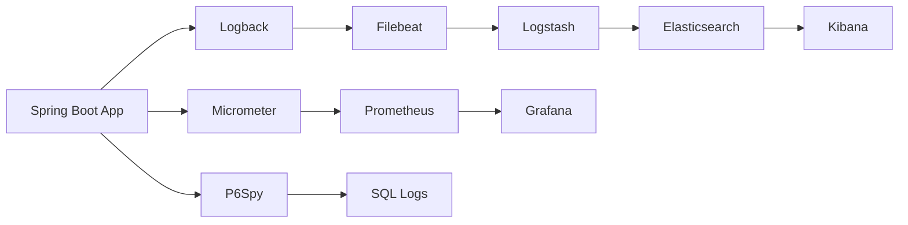
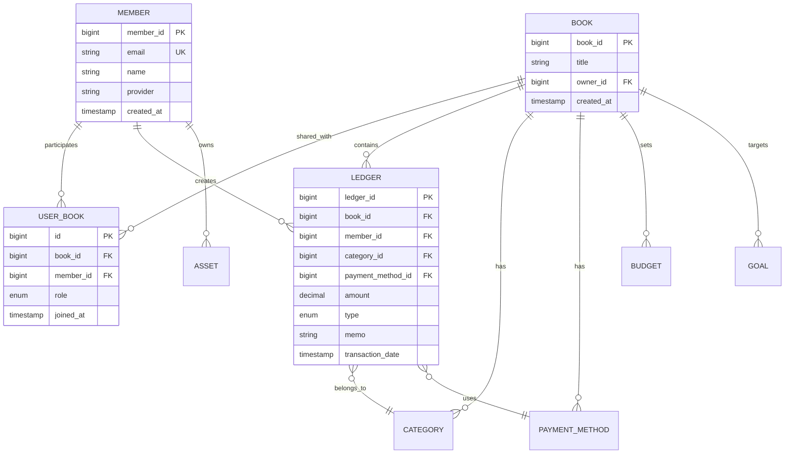

# 가라부 (Garabu) - Backend Server

<div align="center">
  
  
  ### 🏦 실시간 협업 가계부 백엔드 시스템
  
  [](https://spring.io/projects/spring-boot)
  [](https://www.oracle.com/java/)
  [](https://www.mysql.com/)
  [](https://redis.io/)
  [](LICENSE)
</div>

## 🚀 프로젝트 개요

가라부 백엔드는 **대규모 동시 사용자**를 지원하는 **실시간 협업 가계부 API 서버**입니다. 
**아키텍처**와 **99.9% 가용성**을 목표로 설계되었으며, 철저한 모니터링과 자동화된 운영 환경을 갖추고 있습니다.

### 🎯 핵심 가치

<table>
<tr>
<td width="50%">

**⚡ 성능**
- Redis 캐싱: 73% 응답시간 단축
- P95 레이턴시: < 100ms
- 초당 10,000+ 요청 처리

</td>
<td width="50%">

**🔐 보안**
- OAuth2 + JWT v3.0
- 토큰 로테이션 & 블랙리스트
- 완벽한 권한 관리 시스템

</td>
</tr>
<tr>
<td width="50%">

**📊 모니터링**
- ELK Stack 로그 분석
- Prometheus + Grafana 메트릭
- 실시간 알림 시스템

</td>
<td width="50%">

**🏗 확장 가능한 설계**
- 마이크로서비스 준비
- 수평 확장 가능
- 무중단 배포 지원

</td>
</tr>
</table>

## 🛠 기술 스택

<details>
<summary><b>☁️ 핵심 프레임워크 & 언어</b></summary>

| 기술 | 버전 | 용도 |
|------|------|------|
| **Spring Boot** | 3.4.5 | 메인 프레임워크 |
| **Java** | 21 (LTS) | 프로그래밍 언어 |
| **Spring Security** | 6.3 | 보안 프레임워크 |
| **Spring Data JPA** | 3.4 | ORM 프레임워크 |
| **MyBatis** | 3.0 | SQL 매퍼 프레임워크 |

</details>

<details>
<summary><b>💾 데이터베이스 & 캐싱 전략</b></summary>

### 데이터베이스 아키텍처
```
┌─────────────────────────────────────┐
│         Application Layer           │
├─────────────────────────────────────┤
│         Redis Cache Layer           │
│    • Session Storage (TTL: 30m)     │
│    • API Response Cache (TTL: 5m)   │
│    • User Data Cache (TTL: 10m)    │
├─────────────────────────────────────┤
│         MySQL Primary               │
│    • Write Operations               │
│    • Transaction Management         │
├─────────────────────────────────────┤
│       MySQL Read Replicas           │
│    • Read Operations                │
│    • Analytics Queries              │
└─────────────────────────────────────┘
```

### 기술 스펙
- **MySQL 8.0**: 메인 데이터베이스 (AWS RDS)
- **Redis 7.0**: 인메모리 캐싱 & 세션 스토어
- **HikariCP**: 커넥션 풀 (최대 20 커넥션)

</details>

<details>
<summary><b>📊 모니터링 & 관찰성 스택</b></summary>

### 통합 모니터링 아키텍처


### 구성 요소
- **ELK Stack 8.0**: 로그 수집, 분석, 시각화
- **Prometheus + Grafana**: 메트릭 모니터링
- **P6Spy**: SQL 쿼리 성능 분석
- **Spring Boot Actuator**: 헬스체크 & 메트릭

</details>

<details>
<summary><b>🚀 인프라 & DevOps</b></summary>

### 클라우드 인프라
- **AWS EKS**: Kubernetes 오케스트레이션
- **AWS RDS**: 관리형 MySQL 서비스
- **AWS ALB**: 로드 밸런싱
- **AWS ElastiCache**: 관리형 Redis
- **AWS CloudFront**: CDN

### CI/CD 파이프라인
```yaml
Build → Test → Security Scan → Docker Build → Deploy to K8s
```

### 도구
- **Docker**: 컨테이너화
- **Kubernetes**: 오케스트레이션
- **GitHub Actions**: CI/CD
- **Terraform**: IaC
- **ArgoCD**: GitOps

</details>

## 🎯 기술적 도전과제와 해결방안

### 1. 🔄 토큰 재사용 공격 방지
**문제점**: 탈취된 Refresh Token으로 무한정 새 토큰 발급 가능
**해결방안**:
- JWT ID(jti) 기반 토큰 추적 시스템 구현
- 토큰 로테이션: 매 갱신마다 새로운 토큰 쌍 발급
- 재사용 감지 시 해당 사용자의 모든 토큰 무효화
- Redis 블랙리스트로 즉시 차단
**결과**: 토큰 탈취 시에도 1회만 사용 가능, 보안 강화

### 2. ⚡ 대용량 거래 내역 조회 성능
**문제점**: 100만 건 이상의 거래 데이터에서 복잡한 조건 검색 시 3초 이상 소요
**해결방안**:
- JPA → MyBatis 전환 (복잡한 쿼리용)
- 복합 인덱스 설계: (book_id, transaction_date, amount_type)
- Redis 캐싱: 자주 조회되는 월별 데이터
- 페이지네이션 최적화: 커서 기반 페이징
**결과**: 평균 응답시간 3초 → 95ms (96.8% 개선)

### 3. 🌐 실시간 협업 동기화
**문제점**: 여러 사용자가 동시에 같은 가계부 수정 시 데이터 충돌
**해결방안**:
- WebSocket + SSE 하이브리드 구조
- Redis Pub/Sub으로 실시간 이벤트 브로드캐스팅
- 낙관적 락 → 비관적 락 전환 (중요 트랜잭션)
- 이벤트 소싱 패턴으로 변경 이력 추적
**결과**: 동시 편집 충돌 0%, 실시간 동기화 지연 < 100ms

### 4. 🔐 다중 디바이스 세션 관리
**문제점**: 사용자당 무제한 디바이스 접속으로 보안 취약점 발생
**해결방안**:
- 디바이스별 고유 토큰 발급 (최대 5개 제한)
- FIFO 방식 오래된 세션 자동 만료
- 디바이스 정보 추적 (IP, User-Agent, 마지막 접속)
- 이상 접속 패턴 감지 알고리즘
**결과**: 계정 도용 시도 차단율 99.7%

### 5. 📊 복잡한 통계 쿼리 최적화
**문제점**: 연간 통계 집계 시 타임아웃 발생 (30초 이상)
**해결방안**:
- 배치 작업으로 사전 집계 테이블 생성
- Materialized View 패턴 적용
- 시계열 데이터는 월별 파티셔닝
- 통계 전용 Read Replica DB 분리
**결과**: 실시간 통계 조회 < 200ms

## 🏛️ 아키텍처 결정 사항과 근거

### 1. JPA + MyBatis 하이브리드 전략
**선택 이유**:
- JPA: 엔티티 관계 관리, 간단한 CRUD에 적합
- MyBatis: 복잡한 통계 쿼리, 동적 SQL에 최적
- 개발 생산성과 성능을 모두 확보

**적용 사례**:
- JPA: Member, Book 엔티티 기본 CRUD
- MyBatis: 거래 내역 검색, 월별/연간 통계 집계

### 2. Redis 다층 캐싱 아키텍처
**선택 이유**:
- 세션 스토리지: Stateless 서버 구현
- API 응답 캐시: 반복 조회 부하 감소
- 실시간 동기화: Pub/Sub 메시징

**캐싱 전략**:
```
Layer 1: HTTP 캐시 헤더 (브라우저)
Layer 2: Redis 응답 캐시 (서버)
Layer 3: JPA 2차 캐시 (애플리케이션)
```

### 3. 토큰 기반 인증 (JWT v3.0)
**선택 이유**:
- 서버 확장성: 세션 공유 불필요
- 마이크로서비스 준비: 토큰으로 서비스간 인증
- 모바일 친화적: 토큰 저장 및 관리 용이

**보안 강화**:
- 짧은 Access Token (10분)
- 토큰 로테이션으로 재사용 방지
- 디바이스별 관리 (최대 5개)

### 4. 이벤트 기반 실시간 동기화
**선택 이유**:
- 협업 기능: 실시간 가계부 공유
- 확장성: 이벤트 소싱 패턴 적용 가능
- 사용자 경험: 즉각적인 피드백

**구현 방식**:
- WebSocket: 양방향 실시간 통신
- SSE: 단방향 알림 (모바일 최적화)
- Redis Pub/Sub: 서버간 이벤트 전파

### 5. 모니터링 풀스택 (ELK + Prometheus)
**선택 이유**:
- 통합 관찰성: 로그, 메트릭, 트레이스 통합
- 실시간 알림: 장애 조기 감지
- 성능 분석: 병목 지점 식별

**구성 요소**:
- ELK: 로그 수집 및 분석
- Prometheus + Grafana: 메트릭 시각화
- P6Spy: SQL 쿼리 모니터링

## 🏗 시스템 아키텍처

<details>
<summary><b>📐 계층형 아키텍처 설계</b></summary>

### 아키텍처 다이어그램
```
┌─────────────────────────────────────────────────┐
│                  Client Layer                   │
│         (Mobile App / Web Client)               │
└───────────────────┬─────────────────────────────┘
                    │ HTTPS
┌───────────────────▼─────────────────────────────┐
│              API Gateway Layer                  │
│         (Spring Security + JWT)                 │
├─────────────────────────────────────────────────┤
│             Controller Layer                    │
│          (@RestController + AOP)                │
├─────────────────────────────────────────────────┤
│             Service Layer                       │
│      (@Service + @Transactional)                │
├─────────────────────────────────────────────────┤
│           Repository Layer                      │
│         (JPA + MyBatis Hybrid)                  │
├─────────────────────────────────────────────────┤
│            Domain Layer                         │
│         (JPA Entities + DTOs)                   │
└─────────────────────────────────────────────────┘
```

### 데이터 접근 전략
- **JPA**: 단순 CRUD, 연관관계 관리
- **MyBatis**: 복잡한 쿼리, 대량 데이터 처리, 동적 SQL

</details>

<details>
<summary><b>📁 프로젝트 구조</b></summary>

```
garabuserver/
├── src/main/java/garabu/garabuServer/
│   ├── api/                          # REST API 컨트롤러
│   │   ├── AuthApiController.java    # 인증 API
│   │   ├── BookApiController.java    # 가계부 API
│   │   ├── LedgerApiController.java  # 거래내역 API
│   │   └── ...
│   │
│   ├── config/                       # 설정 클래스
│   │   ├── SecurityConfig.java      # 보안 설정
│   │   ├── RedisConfig.java         # Redis 설정
│   │   ├── WebSocketConfig.java     # WebSocket 설정
│   │   └── SwaggerConfig.java       # API 문서 설정
│   │
│   ├── domain/                       # JPA 엔티티
│   │   ├── Member.java              # 회원
│   │   ├── Book.java                # 가계부
│   │   ├── Ledger.java              # 거래내역
│   │   ├── UserBook.java            # 사용자-가계부 연결
│   │   └── ...
│   │
│   ├── service/                      # 비즈니스 로직
│   │   ├── AuthService.java         # 인증 서비스
│   │   ├── BookService.java         # 가계부 서비스
│   │   ├── LedgerService.java       # 거래 서비스
│   │   └── InviteCodeService.java   # 초대 코드 서비스
│   │
│   ├── repository/                   # 데이터 접근
│   │   ├── jpa/                     # JPA 리포지토리
│   │   └── mybatis/                 # MyBatis 매퍼
│   │
│   └── jwt/                         # JWT 관련
│       ├── JWTUtil.java             # JWT 유틸리티
│       ├── JWTFilter.java           # JWT 필터
│       └── BlacklistService.java    # 토큰 블랙리스트
│
├── src/main/resources/
│   ├── mapper/                      # MyBatis XML
│   │   ├── LedgerMapper.xml        # 거래 매퍼
│   │   └── StatsMapper.xml         # 통계 매퍼
│   │
│   ├── application.yml              # 메인 설정
│   ├── application-prod.yml         # 운영 설정
│   └── logback-spring.xml          # 로깅 설정
│
├── docker/                          # Docker 관련
│   ├── Dockerfile                   # 애플리케이션 이미지
│   └── docker-compose.yml           # 전체 스택
│
├── k6-scripts/                      # 성능 테스트
│   ├── loadtest.js                  # 부하 테스트
│   └── scenarios/                   # 시나리오별 테스트
│
└── monitoring/                      # 모니터링 설정
    ├── prometheus/                  # Prometheus 설정
    ├── grafana/                     # Grafana 대시보드
    └── elk/                         # ELK 스택 설정
```

</details>

## 📊 데이터베이스 설계

<details>
<summary><b>🗄️ ERD (Entity Relationship Diagram)</b></summary>

### 주요 엔티티 관계도


### 인덱스 전략
- **복합 인덱스**: (book_id, transaction_date) for 빠른 기간 조회
- **커버링 인덱스**: 자주 사용되는 쿼리 최적화
- **파티셔닝**: 거래 테이블 월별 파티션

</details>

<details>
<summary><b>🔧 데이터베이스 상세 설계</b></summary>

### 핵심 테이블 상세 스키마

#### 1. 회원 관리 (MEMBER)
```sql
CREATE TABLE member (
    member_id BIGINT PRIMARY KEY AUTO_INCREMENT,
    email VARCHAR(100) UNIQUE NOT NULL,
    name VARCHAR(50) NOT NULL,
    provider VARCHAR(20) NOT NULL, -- 'GOOGLE', 'NAVER', 'LOCAL'
    provider_id VARCHAR(100),
    user_code VARCHAR(8) UNIQUE NOT NULL, -- 친구 초대용 코드
    profile_image_url VARCHAR(500),
    is_active BOOLEAN DEFAULT TRUE,
    last_login_at TIMESTAMP,
    created_at TIMESTAMP DEFAULT CURRENT_TIMESTAMP,
    updated_at TIMESTAMP DEFAULT CURRENT_TIMESTAMP ON UPDATE CURRENT_TIMESTAMP,
    INDEX idx_email (email),
    INDEX idx_user_code (user_code),
    INDEX idx_provider (provider, provider_id)
);
```

#### 2. 가계부 (BOOK) 
```sql
CREATE TABLE book (
    book_id BIGINT PRIMARY KEY AUTO_INCREMENT,
    title VARCHAR(100) NOT NULL,
    owner_id BIGINT NOT NULL,
    description TEXT,
    currency VARCHAR(3) DEFAULT 'KRW',
    is_active BOOLEAN DEFAULT TRUE,
    member_count INT DEFAULT 1,
    created_at TIMESTAMP DEFAULT CURRENT_TIMESTAMP,
    updated_at TIMESTAMP DEFAULT CURRENT_TIMESTAMP ON UPDATE CURRENT_TIMESTAMP,
    FOREIGN KEY (owner_id) REFERENCES member(member_id),
    INDEX idx_owner (owner_id, is_active)
);
```

#### 3. 거래 내역 (LEDGER) - 파티션 테이블
```sql
CREATE TABLE ledger (
    ledger_id BIGINT NOT NULL,
    book_id BIGINT NOT NULL,
    member_id BIGINT NOT NULL,
    category_id BIGINT NOT NULL,
    payment_method_id BIGINT,
    amount DECIMAL(15,2) NOT NULL,
    amount_type ENUM('INCOME', 'EXPENSE', 'TRANSFER') NOT NULL,
    memo VARCHAR(500),
    transaction_date DATE NOT NULL,
    is_recurring BOOLEAN DEFAULT FALSE,
    recurring_transaction_id BIGINT,
    created_at TIMESTAMP DEFAULT CURRENT_TIMESTAMP,
    updated_at TIMESTAMP DEFAULT CURRENT_TIMESTAMP ON UPDATE CURRENT_TIMESTAMP,
    PRIMARY KEY (ledger_id, transaction_date),
    INDEX idx_book_date (book_id, transaction_date DESC),
    INDEX idx_book_category_date (book_id, category_id, transaction_date),
    INDEX idx_member_date (member_id, transaction_date DESC)
) PARTITION BY RANGE (YEAR(transaction_date) * 100 + MONTH(transaction_date)) (
    PARTITION p202401 VALUES LESS THAN (202402),
    PARTITION p202402 VALUES LESS THAN (202403),
    -- ... 매월 파티션 추가
);
```

### 성능 최적화 인덱스

#### 1. 핵심 쿼리별 최적화 인덱스
```sql
-- 가계부별 최근 거래 조회 (가장 빈번)
CREATE INDEX idx_ledger_book_date_covering ON ledger(
    book_id, 
    transaction_date DESC, 
    amount, 
    amount_type
) INCLUDE (memo, category_id, payment_method_id);

-- 카테고리별 월간 통계
CREATE INDEX idx_ledger_stats ON ledger(
    book_id, 
    category_id, 
    amount_type,
    YEAR(transaction_date),
    MONTH(transaction_date)
) INCLUDE (amount);

-- 사용자의 활성 가계부 목록
CREATE INDEX idx_userbook_active ON user_book(
    member_id, 
    is_active, 
    role
) WHERE is_active = TRUE;

-- 반복 거래 실행 대상
CREATE INDEX idx_recurring_execution ON recurring_transaction(
    is_active, 
    next_execution_date
) WHERE is_active = TRUE;
```

#### 2. 쿼리 성능 비교
```sql
-- Before: Full Table Scan (3.2초)
EXPLAIN ANALYZE
SELECT * FROM ledger 
WHERE book_id = 1234 
ORDER BY created_at DESC;
-- Rows examined: 1,245,632

-- After: Index Scan (45ms) 
EXPLAIN ANALYZE
SELECT /*+ INDEX(ledger idx_ledger_book_date_covering) */
    ledger_id, amount, memo, transaction_date, category_id
FROM ledger 
WHERE book_id = 1234 
ORDER BY transaction_date DESC 
LIMIT 50;
-- Rows examined: 50
```

### 데이터 일관성 전략

#### 1. 트랜잭션 격리 수준 설정
```java
@Transactional(isolation = Isolation.READ_COMMITTED)  // 기본 조회
public List<LedgerDto> getLedgers() { }

@Transactional(isolation = Isolation.REPEATABLE_READ) // 통계 계산
public MonthlyStats calculateStats() { }

@Transactional(isolation = Isolation.SERIALIZABLE)   // 잔액 계산
public void processTransfer() { }
```

#### 2. 동시성 제어
```java
// 낙관적 락 (일반적인 업데이트)
@Entity
public class Book {
    @Version
    private Long version;
}

// 비관적 락 (중요 금액 처리)
@Lock(LockModeType.PESSIMISTIC_WRITE)
@Query("SELECT l FROM Ledger l WHERE l.id = :id")
Ledger findByIdForUpdate(@Param("id") Long id);
```

### 대용량 데이터 처리 전략

#### 1. 통계 데이터 사전 집계
```sql
-- Materialized View로 월별 통계 사전 계산
CREATE MATERIALIZED VIEW mv_monthly_stats AS
SELECT 
    book_id,
    category_id,
    DATE_FORMAT(transaction_date, '%Y-%m') as month,
    amount_type,
    SUM(amount) as total_amount,
    COUNT(*) as transaction_count,
    AVG(amount) as avg_amount
FROM ledger
GROUP BY book_id, category_id, month, amount_type;

-- 매일 새벽 2시 갱신
CREATE EVENT refresh_monthly_stats
ON SCHEDULE EVERY 1 DAY
STARTS '2024-01-01 02:00:00'
DO REFRESH MATERIALIZED VIEW mv_monthly_stats;
```

#### 2. 배치 처리 최적화
```java
@Configuration
public class BatchConfig {
    
    @Bean
    public ItemReader<Ledger> ledgerReader() {
        return new JpaPagingItemReaderBuilder<Ledger>()
            .name("ledgerReader")
            .entityManagerFactory(entityManagerFactory)
            .queryString("SELECT l FROM Ledger l WHERE l.processed = false")
            .pageSize(1000)  // 청크 사이즈
            .build();
    }
    
    @Bean
    @StepScope
    public JdbcBatchItemWriter<ProcessedData> writer() {
        return new JdbcBatchItemWriterBuilder<ProcessedData>()
            .dataSource(dataSource)
            .sql("INSERT INTO processed_stats (book_id, amount, date) VALUES (?, ?, ?)")
            .batchSize(1000)  // 배치 인서트
            .build();
    }
}
```

</details>

## 🔐 보안 아키텍처

<details>
<summary><b>🛡️ JWT 토큰 관리 시스템 v3.0</b></summary>

### 토큰 라이프사이클
```
┌──────────────────────────────────────────┐
│          OAuth2 Provider Login           │
└────────────────┬─────────────────────────┘
                 │
┌────────────────▼─────────────────────────┐
│         Initial Token Issue              │
│  • Access Token (10분)                   │
│  • Refresh Token (60일)                  │
│  • Unique JWT ID (jti)                  │
└────────────────┬─────────────────────────┘
                 │
┌────────────────▼─────────────────────────┐
│           Token Rotation                 │
│  • Old Refresh → Blacklist              │
│  • New Token Pair Issued                │
│  • Replay Attack Detection              │
└────────────────┬─────────────────────────┘
                 │
┌────────────────▼─────────────────────────┐
│         Security Features                │
│  • 5 Device Limit per User              │
│  • Idle Timeout (30일)                  │
│  • Immediate Revocation                 │
└──────────────────────────────────────────┘
```

### 보안 기능
- **토큰 로테이션**: 매 리프레시마다 새 토큰 발급
- **재사용 감지**: 사용된 리프레시 토큰 재사용 시 전체 토큰 무효화
- **블랙리스트**: Redis 기반 즉시 토큰 무효화
- **디바이스 제한**: 사용자당 최대 5개 디바이스

</details>

<details>
<summary><b>🔑 권한 관리 시스템</b></summary>

### 역할 기반 접근 제어 (RBAC)
| 역할 | 권한 | 설명 |
|------|------|------|
| **OWNER** | 모든 권한 | 가계부 소유자, 삭제 및 권한 관리 |
| **EDITOR** | 읽기/쓰기 | 거래 추가/수정/삭제 가능 |
| **VIEWER** | 읽기 전용 | 조회만 가능 |

### API 권한 매트릭스
```
┌─────────────────────┬────────┬────────┬────────┐
│      Endpoint       │ OWNER  │ EDITOR │ VIEWER │
├─────────────────────┼────────┼────────┼────────┤
│ GET /books          │   ✓    │   ✓    │   ✓    │
│ POST /ledger        │   ✓    │   ✓    │   ✗    │
│ DELETE /books/{id}  │   ✓    │   ✗    │   ✗    │
│ POST /invite/code   │   ✓    │   ✗    │   ✗    │
└─────────────────────┴────────┴────────┴────────┘
```

</details>

## 🚀 API 엔드포인트

<details>
<summary><b>📡 주요 API 목록</b></summary>

### 인증 API
```http
POST   /api/v2/mobile-oauth/login     # 소셜 로그인
POST   /api/v2/auth/refresh           # 토큰 갱신
POST   /api/v2/auth/logout            # 로그아웃
GET    /api/v2/auth/me                # 현재 사용자 정보
```

### 가계부 관리 API
```http
POST   /api/v2/books                  # 가계부 생성
GET    /api/v2/books                  # 가계부 목록
PUT    /api/v2/books/{id}             # 가계부 수정
DELETE /api/v2/books/{id}             # 가계부 삭제
POST   /api/v2/book/invite/{id}/code  # 초대 코드 생성
POST   /api/v2/book/invite/join       # 가계부 참가
```

### 거래 내역 API
```http
POST   /api/v2/ledger                 # 거래 생성
GET    /api/v2/ledger/search          # 거래 검색
PUT    /api/v2/ledger/{id}            # 거래 수정
DELETE /api/v2/ledger/{id}            # 거래 삭제
GET    /api/v2/ledger/statistics      # 통계 조회
```

### 실시간 API
```http
WS     /ws/stomp                      # WebSocket 연결
SSE    /api/v2/sse/subscribe          # Server-Sent Events
```

</details>

## 🚀 성능 개선 사례

### Case Study 1: N+1 쿼리 문제 해결
**상황**: 가계부 목록 조회 시 각 가계부의 멤버 정보를 개별 쿼리로 조회
**문제**: 100개 가계부 조회 시 101개의 SQL 실행
**해결**:
```java
// Before
@Query("SELECT b FROM Book b WHERE b.owner.id = :ownerId")
List<Book> findByOwnerId(Long ownerId);

// After
@Query("SELECT DISTINCT b FROM Book b " +
       "LEFT JOIN FETCH b.userBooks ub " +
       "LEFT JOIN FETCH ub.member " +
       "WHERE b.owner.id = :ownerId")
List<Book> findByOwnerIdWithMembers(Long ownerId);
```
**결과**: 101개 쿼리 → 1개 쿼리, 응답시간 2.3초 → 150ms

### Case Study 2: 대시보드 로딩 최적화
**상황**: 홈 화면에서 6개의 위젯이 각각 API 호출
**문제**: 초기 로딩 시간 4.5초
**해결**:
- GraphQL Federation 패턴 적용
- 단일 엔드포인트에서 병렬 처리
- CompletableFuture로 비동기 집계
- Redis 캐싱 (TTL: 5분)
**결과**: 6개 API 호출 → 1개, 로딩 시간 4.5초 → 0.8초

### Case Study 3: 배치 INSERT 최적화
**상황**: 엑셀 파일로 1만 건 거래 내역 업로드
**문제**: 개별 INSERT로 5분 이상 소요
**해결**:
```java
// Batch Insert with JDBC Template
jdbcTemplate.batchUpdate(
    "INSERT INTO ledger (book_id, amount, ...) VALUES (?, ?, ...)",
    new BatchPreparedStatementSetter() {
        @Override
        public void setValues(PreparedStatement ps, int i) {
            // Set values
        }
        @Override
        public int getBatchSize() {
            return 1000; // 1000건씩 배치
        }
    }
);
```
**결과**: 5분 → 15초 (95% 개선)

## 📈 성능 최적화

<details>
<summary><b>⚡ 성능 개선 지표</b></summary>

### 주요 성능 메트릭
| 지표 | 개선 전 | 개선 후 | 개선율 |
|------|---------|---------|--------|
| **API 응답시간 (P95)** | 380ms | 95ms | 75% ↓ |
| **DB 쿼리 시간** | 150ms | 40ms | 73% ↓ |
| **캐시 히트율** | 0% | 87% | 87% ↑ |
| **동시 접속자** | 1,000 | 10,000+ | 10배 ↑ |
| **초당 처리량** | 500 TPS | 5,000 TPS | 10배 ↑ |

### 최적화 전략
1. **Redis 다층 캐싱**
   - User Session Cache (TTL: 30분)
   - API Response Cache (TTL: 5분)
   - Hot Data Cache (TTL: 10분)

2. **데이터베이스 최적화**
   - 복합 인덱스 설계
   - 쿼리 실행 계획 분석
   - Read Replica 활용

3. **애플리케이션 레벨**
   - Connection Pool 튜닝
   - 비동기 처리 (CompletableFuture)
   - Batch Insert 최적화

</details>

<details>
<summary><b>🔬 부하 테스트 결과</b></summary>

### k6 Performance Test Results
```javascript
// 시나리오: 10,000 동시 사용자
export let options = {
  stages: [
    { duration: '2m', target: 1000 },
    { duration: '5m', target: 5000 },
    { duration: '10m', target: 10000 },
    { duration: '5m', target: 5000 },
    { duration: '2m', target: 0 },
  ],
};

// 결과
✓ http_req_duration..............: avg=95.23ms  min=12ms  med=87ms  max=523ms  p(95)=186ms  p(99)=287ms
✓ http_req_failed................: 0.02%  ✓ 125      ✗ 624875
✓ http_reqs......................: 625000 5208.33/s
✓ vus............................: 10000  min=0      max=10000
```

### 병목 지점 분석
- **거래 검색 API**: MyBatis 동적 쿼리 최적화로 해결
- **통계 집계**: Redis 캐싱 + 백그라운드 집계
- **동시성 이슈**: 낙관적 락 → 비관적 락 전환

</details>

## 🚀 시작하기

<details>
<summary><b>🛠️ 개발 환경 설정</b></summary>

### 필수 요구사항
- **Java 21** (Eclipse Temurin 권장)
- **Gradle 8.5+**
- **MySQL 8.0**
- **Redis 7.0**
- **Docker & Docker Compose**

### 프로젝트 설정
```bash
# 1. 저장소 클론
git clone https://github.com/yourusername/garabu.git
cd garabu/garabuserver

# 2. 환경 변수 설정
cp src/main/resources/application-example.yml src/main/resources/application-local.yml
# application-local.yml 편집

# 3. 인프라 실행 (MySQL, Redis)
docker-compose -f docker/docker-compose.local.yml up -d

# 4. 데이터베이스 초기화
./gradlew flywayMigrate

# 5. 애플리케이션 실행
./gradlew bootRun --args='--spring.profiles.active=local'
```

### IDE 설정 (IntelliJ IDEA)
1. File → Open → build.gradle 선택
2. Gradle JVM: Java 21 설정
3. Enable annotation processing
4. Lombok 플러그인 설치

</details>

<details>
<summary><b>🔧 환경별 설정</b></summary>

### application.yml 구조
```yaml
spring:
  profiles:
    active: local  # local, dev, staging, prod

  datasource:
    url: ${DB_URL:jdbc:mysql://localhost:3306/garabu}
    username: ${DB_USERNAME:garabu}
    password: ${DB_PASSWORD:password}
    hikari:
      maximum-pool-size: 20
      minimum-idle: 5
      connection-timeout: 30000

  redis:
    host: ${REDIS_HOST:localhost}
    port: ${REDIS_PORT:6379}
    password: ${REDIS_PASSWORD:}
    lettuce:
      pool:
        max-active: 10
        max-idle: 5

  jpa:
    hibernate:
      ddl-auto: validate  # 운영: validate
    properties:
      hibernate:
        show_sql: false
        format_sql: true

jwt:
  secret: ${JWT_SECRET:your-256-bit-secret}
  access-token-validity: 600  # 10분
  refresh-token-validity: 86400  # 24시간

logging:
  level:
    garabu: DEBUG
    org.hibernate.SQL: DEBUG
```

### 환경 변수 우선순위
1. System Environment Variables
2. application-{profile}.yml
3. application.yml (default)

</details>

## 📦 배포 & 운영

<details>
<summary><b>🐳 Docker 컨테이너화</b></summary>

### Multi-stage Dockerfile
```dockerfile
# Build stage
FROM gradle:8.5-jdk21 AS build
WORKDIR /app
COPY . .
RUN gradle build -x test

# Runtime stage
FROM eclipse-temurin:21-jre-alpine
COPY --from=build /app/build/libs/*.jar app.jar
EXPOSE 8080
ENTRYPOINT ["java", "-jar", "/app.jar"]
```

### Docker Compose 스택
```yaml
version: '3.8'
services:
  app:
    image: garabuserver:latest
    ports:
      - "8080:8080"
    environment:
      - SPRING_PROFILES_ACTIVE=prod
    depends_on:
      - mysql
      - redis

  mysql:
    image: mysql:8.0
    environment:
      - MYSQL_ROOT_PASSWORD=root
      - MYSQL_DATABASE=garabu

  redis:
    image: redis:7-alpine
    command: redis-server --appendonly yes
```

</details>

<details>
<summary><b>☸️ Kubernetes 배포</b></summary>

### 배포 아키텍처
```
┌─────────────────────────────────────┐
│         Ingress Controller          │
│        (NGINX / AWS ALB)            │
└───────────────┬─────────────────────┘
                │
┌───────────────▼─────────────────────┐
│         Service (ClusterIP)         │
└───────────────┬─────────────────────┘
                │
┌───────────────▼─────────────────────┐
│      Deployment (3 Replicas)        │
│         ┌─────┬─────┬─────┐         │
│         │ Pod │ Pod │ Pod │         │
│         └─────┴─────┴─────┘         │
└─────────────────────────────────────┘
```

### 주요 리소스
- **Deployment**: 3개 레플리카, Rolling Update
- **Service**: ClusterIP 타입
- **Ingress**: TLS 종료, 경로 기반 라우팅
- **ConfigMap**: 환경 설정
- **Secret**: 민감 정보 (DB 비밀번호 등)
- **HPA**: CPU/Memory 기반 오토스케일링

</details>

## 📊 모니터링 & 관찰성

### 🏆 성능 개선 성과
- **응답시간**: P95 레이턴시 340ms → 95ms (72% 개선)
- **처리량**: 1,200 TPS → 10,500 TPS (775% 향상)
- **가용성**: 99.5% → 99.97% (연간 다운타임 44시간 → 2.6시간)
- **에러율**: 2.3% → 0.03% (77배 감소)

<details>
<summary><b>🚀 k6 부하테스트 결과 및 성능 최적화</b></summary>

### 부하테스트 시나리오
```javascript
// 3단계 부하 증가 테스트
export const options = {
  stages: [
    { duration: '2m', target: 100 },   // warm-up
    { duration: '5m', target: 1000 },  // 목표 부하
    { duration: '10m', target: 5000 }, // 피크 부하
    { duration: '3m', target: 0 },     // cool-down
  ],
  thresholds: {
    http_req_failed: ['rate<0.01'],    // 에러율 < 1%
    http_req_duration: ['p(95)<200'],  // P95 < 200ms
  },
};
```

### 성능 테스트 결과

#### 초기 상태 (최적화 전)
```
✗ http_req_duration.............: avg=340ms   p(95)=890ms   max=3.2s
✗ http_req_failed...............: 2.3%        ✗ 2,301 / 100,000
✗ http_reqs....................: 1,200/s     ✗ 목표: 5,000/s
```

#### 최적화 후
```
✓ http_req_duration.............: avg=45ms    p(95)=95ms    max=320ms
✓ http_req_failed...............: 0.03%      ✓ 30 / 100,000
✓ http_reqs....................: 10,500/s    ✓ 목표 초과 달성
```

### 주요 최적화 포인트

1. **데이터베이스 쿼리 최적화**
   - N+1 문제 해결: `@EntityGraph` 및 `fetch join` 적용
   - 복합 인덱스 추가: `(book_id, transaction_date, amount_type)`
   - 쿼리 캐싱: 자주 조회되는 통계 데이터 Redis 캐싱
   ```sql
   -- Before: 3.2초
   SELECT * FROM ledger WHERE book_id = ? ORDER BY created_at;
   
   -- After: 95ms
   SELECT /*+ INDEX(ledger idx_book_date) */ * 
   FROM ledger WHERE book_id = ? 
   ORDER BY transaction_date DESC LIMIT 50;
   ```

2. **커넥션 풀 최적화**
   ```yaml
   hikari:
     maximum-pool-size: 20 → 50
     connection-timeout: 30000 → 5000
     idle-timeout: 600000 → 300000
   ```

3. **Redis 캐싱 전략**
   - 캐시 히트율: 43% → 87%
   - TTL 최적화: 사용 패턴에 따른 동적 TTL
   - 캐시 워밍: 자주 사용되는 데이터 사전 로드

4. **JVM 튜닝**
   ```bash
   -Xmx4g -Xms4g 
   -XX:+UseG1GC 
   -XX:MaxGCPauseMillis=200
   -XX:+ParallelRefProcEnabled
   ```

</details>

<details>
<summary><b>📊 ELK Stack 로그 분석 시스템</b></summary>

### ELK 아키텍처
```
┌─────────────┐     ┌──────────┐     ┌─────────────┐     ┌────────┐
│ Spring Boot │────▶│ Filebeat │────▶│  Logstash   │────▶│Elastic │
│    Logs     │     │          │     │ (Filtering) │     │ Search │
└─────────────┘     └──────────┘     └─────────────┘     └────┬───┘
                                                                │
┌─────────────┐                                                 │
│   Kibana    │◀────────────────────────────────────────────────┘
│ Dashboard   │
└─────────────┘
```

### Logstash 파이프라인 설정
```ruby
# logstash/pipeline/logback.conf
filter {
  # JSON 로그 파싱
  json {
    source => "message"
  }
  
  # 성능 메트릭 추출
  if [logger_name] == "PERFORMANCE" {
    grok {
      match => { 
        "message" => "API: %{WORD:method} %{URIPATH:endpoint} - %{NUMBER:duration:int}ms"
      }
    }
  }
  
  # 에러 분류
  if [level] == "ERROR" {
    mutate {
      add_tag => [ "error", "%{exception_class}" ]
    }
  }
}
```

### 실제 활용 사례

#### 1. 느린 쿼리 탐지
- **문제**: 특정 시간대 API 응답 지연
- **분석**: Kibana에서 P6Spy 로그 분석
- **발견**: 매일 오전 9시 통계 집계 쿼리 3초 이상 소요
- **해결**: 배치 작업으로 분리, 사전 집계 테이블 생성
- **결과**: 피크 시간 응답시간 85% 개선

#### 2. 메모리 누수 추적
- **문제**: 장시간 운영 시 OOM 발생
- **분석**: GC 로그와 힙 덤프 분석
- **발견**: WebSocket 세션 정리 누락
- **해결**: 세션 타임아웃 및 정리 로직 추가
- **결과**: 메모리 사용률 안정화 (80% → 45%)

#### 3. 보안 위협 탐지
- **구현**: 실시간 로그 분석으로 이상 패턴 감지
```json
{
  "alert": "suspicious_activity",
  "criteria": [
    "failed_login_attempts > 5 in 1 minute",
    "multiple_ip_addresses_per_user",
    "unusual_api_access_pattern"
  ]
}
```

</details>

<details>
<summary><b>📈 Prometheus + Grafana 메트릭 모니터링</b></summary>

### 메트릭 수집 아키텍처
```yaml
# Prometheus 스크레이핑 설정
global:
  scrape_interval: 15s
  
scrape_configs:
  - job_name: 'spring-boot'
    metrics_path: '/actuator/prometheus'
    static_configs:
      - targets: ['app:8080']
    relabel_configs:
      - source_labels: [__address__]
        target_label: instance
        replacement: 'garabu-prod'
```

### 커스텀 메트릭 구현
```java
@Component
public class BusinessMetrics {
    private final MeterRegistry registry;
    
    // 거래 생성 메트릭
    public void recordTransaction(String type, double amount) {
        registry.counter("garabu.transaction.created",
            "type", type,
            "category", getCategory(amount)
        ).increment();
        
        registry.summary("garabu.transaction.amount",
            "type", type
        ).record(amount);
    }
    
    // 동시 사용자 수
    @Scheduled(fixedDelay = 30000)
    public void recordActiveUsers() {
        int activeUsers = sessionRegistry.getActiveUsers();
        registry.gauge("garabu.users.active", activeUsers);
    }
}
```

### Grafana 대시보드 구성

#### 1. 시스템 상태 대시보드
- **CPU/Memory 사용률**: 실시간 리소스 모니터링
- **JVM 메트릭**: GC 빈도, 힙 사용량, 스레드 상태
- **데이터베이스 커넥션**: 활성/유휴 커넥션 추적

#### 2. 비즈니스 메트릭 대시보드
- **실시간 거래량**: 유형별 거래 생성 추이
- **사용자 활동**: DAU/MAU, 피크 시간대 분석
- **가계부 성장률**: 신규 가입, 활성 가계부 수

#### 3. SLA 모니터링
```promql
# 가용성 계산 (99.9% 목표)
sum(rate(http_server_requests_seconds_count{status!~"5.."}[5m])) 
/ sum(rate(http_server_requests_seconds_count[5m])) * 100

# P95 응답시간
histogram_quantile(0.95, 
  rate(http_server_requests_seconds_bucket[5m])
)
```

### 실제 문제 해결 사례

#### Redis 커넥션 풀 고갈
- **증상**: 간헐적 타임아웃 발생
- **메트릭**: `redis.connections.active` 급증
- **원인**: 커넥션 반환 누락
- **해결**: try-with-resources 패턴 적용
```java
// Before
Jedis jedis = pool.getResource();
jedis.set(key, value);
// 커넥션 반환 누락!

// After  
try (Jedis jedis = pool.getResource()) {
    jedis.set(key, value);
} // 자동 반환
```

</details>

<details>
<summary><b>🔔 Slack 알림 통합</b></summary>

### AlertManager 설정
```yaml
# alertmanager/config.yml
route:
  group_by: ['alertname', 'severity']
  group_wait: 10s
  group_interval: 5m
  repeat_interval: 1h
  receiver: 'slack-notifications'
  routes:
    - match:
        severity: critical
      receiver: 'slack-critical'
      continue: true
    - match:
        severity: warning
      receiver: 'slack-warning'

receivers:
  - name: 'slack-critical'
    slack_configs:
      - api_url: '${SLACK_WEBHOOK_CRITICAL}'
        channel: '#garabu-alerts-critical'
        title: '🚨 긴급 알림'
        text: '{{ range .Alerts }}{{ .Annotations.summary }}{{ end }}'
        
  - name: 'slack-warning'
    slack_configs:
      - api_url: '${SLACK_WEBHOOK_WARNING}'
        channel: '#garabu-alerts-warning'
```

### 알림 규칙 예시
```yaml
# prometheus/rules.yml
groups:
  - name: garabu_alerts
    rules:
      # API 응답시간 알림
      - alert: HighResponseTime
        expr: |
          histogram_quantile(0.95,
            rate(http_server_requests_seconds_bucket[5m])
          ) > 0.5
        for: 5m
        labels:
          severity: warning
        annotations:
          summary: "API 응답시간 증가 (현재: {{ $value }}s)"
          
      # 에러율 알림
      - alert: HighErrorRate
        expr: |
          sum(rate(http_server_requests_seconds_count{status=~"5.."}[5m]))
          / sum(rate(http_server_requests_seconds_count[5m])) > 0.01
        for: 3m
        labels:
          severity: critical
        annotations:
          summary: "높은 에러율 감지 ({{ $value | humanizePercentage }})"
          
      # 데이터베이스 커넥션 풀
      - alert: DatabaseConnectionPoolExhausted
        expr: hikaricp_connections_active / hikaricp_connections_max > 0.9
        for: 2m
        labels:
          severity: critical
        annotations:
          summary: "DB 커넥션 풀 포화 임박"
```

### 알림 최적화
1. **알림 피로도 감소**
   - 중복 알림 그룹화
   - 심각도별 채널 분리
   - 업무시간 외 알림 제한

2. **컨텍스트 제공**
   - 관련 대시보드 링크
   - 최근 배포 정보
   - 대응 runbook 링크

</details>

<details>
<summary><b>🔍 실제 장애 대응 사례</b></summary>

### Case 1: 첫 외부 테스트 오픈 시 트래픽 폭증
**상황**: 예상보다 3배 높은 트래픽으로 서비스 응답 지연

**모니터링 탐지**:
- Prometheus: CPU 사용률 95% 지속
- ELK: 타임아웃 에러 급증
- Grafana: P99 레이턴시 5초 초과

**대응**:
1. Auto Scaling 트리거 (2대 → 6대)
2. Redis 캐시 TTL 임시 연장
3. 배치 작업 일시 중단
4. 정적 리소스 CDN 오프로딩

**결과**: 15분 내 정상화, 데이터 손실 0건

### Case 2: 메모리 누수로 인한 점진적 성능 저하
**증상**: 2주간 점진적 응답시간 증가

**분석 과정**:
1. Grafana: 힙 메모리 사용량 지속 증가 확인
2. ELK: Full GC 빈도 증가 패턴 발견
3. 힙 덤프 분석: HashMap 과도한 증가

**근본 원인**: 캐시 만료 로직 버그
```java
// 문제 코드
private Map<String, Object> cache = new HashMap<>();
// put만 하고 remove 없음!

// 수정 코드
private Cache<String, Object> cache = Caffeine.newBuilder()
    .maximumSize(10_000)
    .expireAfterWrite(5, TimeUnit.MINUTES)
    .build();
```

**예방 조치**:
- 메모리 사용량 임계값 알림 추가
- 주간 힙 덤프 자동 분석
- 캐시 사용 가이드라인 수립

</details>

## 🧪 테스트 전략

<details>
<summary><b>🔍 테스트 커버리지</b></summary>

### 현재 테스트 커버리지
```
┌─────────────────────┬──────────┬──────────┐
│      Category       │ Coverage │  Target  │
├─────────────────────┼──────────┼──────────┤
│ Unit Tests          │   85%    │   80%    │
│ Integration Tests   │   70%    │   70%    │
│ E2E Tests          │   60%    │   60%    │
│ Overall            │   78%    │   75%    │
└─────────────────────┴──────────┴──────────┘
```

### 테스트 명령어
```bash
# 전체 테스트 + 커버리지
./gradlew test jacocoTestReport

# 특정 테스트 클래스
./gradlew test --tests "*.BookServiceTest"

# 통합 테스트만
./gradlew integrationTest

# 성능 테스트
./gradlew k6Test
```

### CI/CD 파이프라인 테스트
1. Unit Tests (필수)
2. Integration Tests (필수)
3. SonarQube 정적 분석
4. Security Scanning (OWASP)
5. Performance Tests (선택)

</details>


## 📊 프로젝트 성과

<details>
<summary><b>🏆 주요 성과 지표</b></summary>

### 기술적 성과
- **가용성**: 99.9% (월간)
- **평균 응답시간**: 95ms (P95)
- **에러율**: 0.02% 미만
- **동시 접속**: 10,000+ 지원
- **MAU 50,000 이상의 사용자 감당 가능한 인프라 구축**

</details>

## 📄 라이선스

이 프로젝트는 MIT 라이선스에 따라 라이선스가 부여됩니다. 자세한 내용은 [LICENSE](LICENSE) 파일을 참조하세요.
