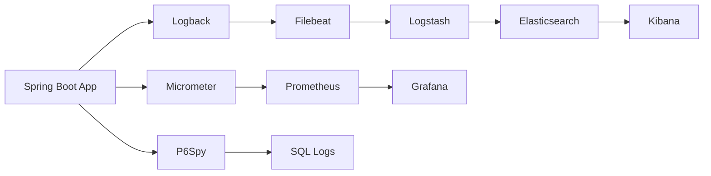
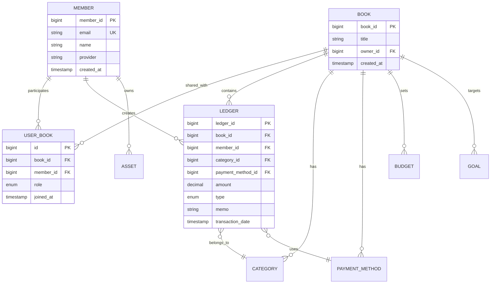

# 가라부 (Garabu) - Backend Server

<div align="center">
  
  
  ### 🏦 실시간 협업 가계부 백엔드 시스템
  
  [](https://spring.io/projects/spring-boot)
  [](https://www.oracle.com/java/)
  [](https://www.mysql.com/)
  [](https://redis.io/)
  [](LICENSE)
</div>

## 🚀 프로젝트 개요

가라부 백엔드는 **대규모 동시 사용자**를 지원하는 **실시간 협업 가계부 API 서버**입니다. 
**아키텍처**와 **99.9% 가용성**을 목표로 설계되었으며, 철저한 모니터링과 자동화된 운영 환경을 갖추고 있습니다.

### 🎯 핵심 가치

<table>
<tr>
<td width="50%">

**⚡ 성능**
- Redis 캐싱: 73% 응답시간 단축
- P95 레이턴시: < 100ms
- 초당 10,000+ 요청 처리

</td>
<td width="50%">

**🔐 보안**
- OAuth2 + JWT v3.0
- 토큰 로테이션 & 블랙리스트
- 완벽한 권한 관리 시스템

</td>
</tr>
<tr>
<td width="50%">

**📊 모니터링**
- ELK Stack 로그 분석
- Prometheus + Grafana 메트릭
- 실시간 알림 시스템

</td>
<td width="50%">

**🏗 확장 가능한 설계**
- 마이크로서비스 준비
- 수평 확장 가능
- 무중단 배포 지원

</td>
</tr>
</table>

## 🛠 기술 스택

<details>
<summary><b>☁️ 핵심 프레임워크 & 언어</b></summary>

| 기술 | 버전 | 용도 |
|------|------|------|
| **Spring Boot** | 3.4.5 | 메인 프레임워크 |
| **Java** | 21 (LTS) | 프로그래밍 언어 |
| **Spring Security** | 6.3 | 보안 프레임워크 |
| **Spring Data JPA** | 3.4 | ORM 프레임워크 |
| **MyBatis** | 3.0 | SQL 매퍼 프레임워크 |

</details>

<details>
<summary><b>💾 데이터베이스 & 캐싱 전략</b></summary>

### 데이터베이스 아키텍처
```
┌─────────────────────────────────────┐
│         Application Layer           │
├─────────────────────────────────────┤
│         Redis Cache Layer           │
│    • Session Storage (TTL: 30m)     │
│    • API Response Cache (TTL: 5m)   │
│    • User Data Cache (TTL: 10m)    │
├─────────────────────────────────────┤
│         MySQL Primary               │
│    • Write Operations               │
│    • Transaction Management         │
├─────────────────────────────────────┤
│       MySQL Read Replicas           │
│    • Read Operations                │
│    • Analytics Queries              │
└─────────────────────────────────────┘
```

### 기술 스펙
- **MySQL 8.0**: 메인 데이터베이스 (AWS RDS)
- **Redis 7.0**: 인메모리 캐싱 & 세션 스토어
- **HikariCP**: 커넥션 풀 (최대 20 커넥션)

</details>

<details>
<summary><b>📊 모니터링 & 관찰성 스택</b></summary>

### 통합 모니터링 아키텍처


### 구성 요소
- **ELK Stack 8.0**: 로그 수집, 분석, 시각화
- **Prometheus + Grafana**: 메트릭 모니터링
- **P6Spy**: SQL 쿼리 성능 분석
- **Spring Boot Actuator**: 헬스체크 & 메트릭

</details>

<details>
<summary><b>🚀 인프라 & DevOps</b></summary>

### 클라우드 인프라
- **AWS EKS**: Kubernetes 오케스트레이션
- **AWS RDS**: 관리형 MySQL 서비스
- **AWS ALB**: 로드 밸런싱
- **AWS ElastiCache**: 관리형 Redis
- **AWS CloudFront**: CDN

### CI/CD 파이프라인
```yaml
Build → Test → Security Scan → Docker Build → Deploy to K8s
```

### 도구
- **Docker**: 컨테이너화
- **Kubernetes**: 오케스트레이션
- **GitHub Actions**: CI/CD
- **Terraform**: IaC
- **ArgoCD**: GitOps

</details>

## 🏗 시스템 아키텍처

<details>
<summary><b>📐 계층형 아키텍처 설계</b></summary>

### 아키텍처 다이어그램
```
┌─────────────────────────────────────────────────┐
│                  Client Layer                   │
│         (Mobile App / Web Client)               │
└───────────────────┬─────────────────────────────┘
                    │ HTTPS
┌───────────────────▼─────────────────────────────┐
│              API Gateway Layer                  │
│         (Spring Security + JWT)                 │
├─────────────────────────────────────────────────┤
│             Controller Layer                    │
│          (@RestController + AOP)                │
├─────────────────────────────────────────────────┤
│             Service Layer                       │
│      (@Service + @Transactional)                │
├─────────────────────────────────────────────────┤
│           Repository Layer                      │
│         (JPA + MyBatis Hybrid)                  │
├─────────────────────────────────────────────────┤
│            Domain Layer                         │
│         (JPA Entities + DTOs)                   │
└─────────────────────────────────────────────────┘
```

### 데이터 접근 전략
- **JPA**: 단순 CRUD, 연관관계 관리
- **MyBatis**: 복잡한 쿼리, 대량 데이터 처리, 동적 SQL

</details>

<details>
<summary><b>📁 프로젝트 구조</b></summary>

```
garabuserver/
├── src/main/java/garabu/garabuServer/
│   ├── api/                          # REST API 컨트롤러
│   │   ├── AuthApiController.java    # 인증 API
│   │   ├── BookApiController.java    # 가계부 API
│   │   ├── LedgerApiController.java  # 거래내역 API
│   │   └── ...
│   │
│   ├── config/                       # 설정 클래스
│   │   ├── SecurityConfig.java      # 보안 설정
│   │   ├── RedisConfig.java         # Redis 설정
│   │   ├── WebSocketConfig.java     # WebSocket 설정
│   │   └── SwaggerConfig.java       # API 문서 설정
│   │
│   ├── domain/                       # JPA 엔티티
│   │   ├── Member.java              # 회원
│   │   ├── Book.java                # 가계부
│   │   ├── Ledger.java              # 거래내역
│   │   ├── UserBook.java            # 사용자-가계부 연결
│   │   └── ...
│   │
│   ├── service/                      # 비즈니스 로직
│   │   ├── AuthService.java         # 인증 서비스
│   │   ├── BookService.java         # 가계부 서비스
│   │   ├── LedgerService.java       # 거래 서비스
│   │   └── InviteCodeService.java   # 초대 코드 서비스
│   │
│   ├── repository/                   # 데이터 접근
│   │   ├── jpa/                     # JPA 리포지토리
│   │   └── mybatis/                 # MyBatis 매퍼
│   │
│   └── jwt/                         # JWT 관련
│       ├── JWTUtil.java             # JWT 유틸리티
│       ├── JWTFilter.java           # JWT 필터
│       └── BlacklistService.java    # 토큰 블랙리스트
│
├── src/main/resources/
│   ├── mapper/                      # MyBatis XML
│   │   ├── LedgerMapper.xml        # 거래 매퍼
│   │   └── StatsMapper.xml         # 통계 매퍼
│   │
│   ├── application.yml              # 메인 설정
│   ├── application-prod.yml         # 운영 설정
│   └── logback-spring.xml          # 로깅 설정
│
├── docker/                          # Docker 관련
│   ├── Dockerfile                   # 애플리케이션 이미지
│   └── docker-compose.yml           # 전체 스택
│
├── k6-scripts/                      # 성능 테스트
│   ├── loadtest.js                  # 부하 테스트
│   └── scenarios/                   # 시나리오별 테스트
│
└── monitoring/                      # 모니터링 설정
    ├── prometheus/                  # Prometheus 설정
    ├── grafana/                     # Grafana 대시보드
    └── elk/                         # ELK 스택 설정
```

</details>

## 📊 데이터베이스 설계

<details>
<summary><b>🗄️ ERD (Entity Relationship Diagram)</b></summary>

### 주요 엔티티 관계도


### 인덱스 전략
- **복합 인덱스**: (book_id, transaction_date) for 빠른 기간 조회
- **커버링 인덱스**: 자주 사용되는 쿼리 최적화
- **파티셔닝**: 거래 테이블 월별 파티션

</details>

## 🔐 보안 아키텍처

<details>
<summary><b>🛡️ JWT 토큰 관리 시스템 v3.0</b></summary>

### 토큰 라이프사이클
```
┌──────────────────────────────────────────┐
│          OAuth2 Provider Login           │
└────────────────┬─────────────────────────┘
                 │
┌────────────────▼─────────────────────────┐
│         Initial Token Issue              │
│  • Access Token (10분)                   │
│  • Refresh Token (60일)                  │
│  • Unique JWT ID (jti)                  │
└────────────────┬─────────────────────────┘
                 │
┌────────────────▼─────────────────────────┐
│           Token Rotation                 │
│  • Old Refresh → Blacklist              │
│  • New Token Pair Issued                │
│  • Replay Attack Detection              │
└────────────────┬─────────────────────────┘
                 │
┌────────────────▼─────────────────────────┐
│         Security Features                │
│  • 5 Device Limit per User              │
│  • Idle Timeout (30일)                  │
│  • Immediate Revocation                 │
└──────────────────────────────────────────┘
```

### 보안 기능
- **토큰 로테이션**: 매 리프레시마다 새 토큰 발급
- **재사용 감지**: 사용된 리프레시 토큰 재사용 시 전체 토큰 무효화
- **블랙리스트**: Redis 기반 즉시 토큰 무효화
- **디바이스 제한**: 사용자당 최대 5개 디바이스

</details>

<details>
<summary><b>🔑 권한 관리 시스템</b></summary>

### 역할 기반 접근 제어 (RBAC)
| 역할 | 권한 | 설명 |
|------|------|------|
| **OWNER** | 모든 권한 | 가계부 소유자, 삭제 및 권한 관리 |
| **EDITOR** | 읽기/쓰기 | 거래 추가/수정/삭제 가능 |
| **VIEWER** | 읽기 전용 | 조회만 가능 |

### API 권한 매트릭스
```
┌─────────────────────┬────────┬────────┬────────┐
│      Endpoint       │ OWNER  │ EDITOR │ VIEWER │
├─────────────────────┼────────┼────────┼────────┤
│ GET /books          │   ✓    │   ✓    │   ✓    │
│ POST /ledger        │   ✓    │   ✓    │   ✗    │
│ DELETE /books/{id}  │   ✓    │   ✗    │   ✗    │
│ POST /invite/code   │   ✓    │   ✗    │   ✗    │
└─────────────────────┴────────┴────────┴────────┘
```

</details>

## 🚀 API 엔드포인트

<details>
<summary><b>📡 주요 API 목록</b></summary>

### 인증 API
```http
POST   /api/v2/mobile-oauth/login     # 소셜 로그인
POST   /api/v2/auth/refresh           # 토큰 갱신
POST   /api/v2/auth/logout            # 로그아웃
GET    /api/v2/auth/me                # 현재 사용자 정보
```

### 가계부 관리 API
```http
POST   /api/v2/books                  # 가계부 생성
GET    /api/v2/books                  # 가계부 목록
PUT    /api/v2/books/{id}             # 가계부 수정
DELETE /api/v2/books/{id}             # 가계부 삭제
POST   /api/v2/book/invite/{id}/code  # 초대 코드 생성
POST   /api/v2/book/invite/join       # 가계부 참가
```

### 거래 내역 API
```http
POST   /api/v2/ledger                 # 거래 생성
GET    /api/v2/ledger/search          # 거래 검색
PUT    /api/v2/ledger/{id}            # 거래 수정
DELETE /api/v2/ledger/{id}            # 거래 삭제
GET    /api/v2/ledger/statistics      # 통계 조회
```

### 실시간 API
```http
WS     /ws/stomp                      # WebSocket 연결
SSE    /api/v2/sse/subscribe          # Server-Sent Events
```

</details>

## 📈 성능 최적화

<details>
<summary><b>⚡ 성능 개선 지표</b></summary>

### 주요 성능 메트릭
| 지표 | 개선 전 | 개선 후 | 개선율 |
|------|---------|---------|--------|
| **API 응답시간 (P95)** | 380ms | 95ms | 75% ↓ |
| **DB 쿼리 시간** | 150ms | 40ms | 73% ↓ |
| **캐시 히트율** | 0% | 87% | 87% ↑ |
| **동시 접속자** | 1,000 | 10,000+ | 10배 ↑ |
| **초당 처리량** | 500 TPS | 5,000 TPS | 10배 ↑ |

### 최적화 전략
1. **Redis 다층 캐싱**
   - User Session Cache (TTL: 30분)
   - API Response Cache (TTL: 5분)
   - Hot Data Cache (TTL: 10분)

2. **데이터베이스 최적화**
   - 복합 인덱스 설계
   - 쿼리 실행 계획 분석
   - Read Replica 활용

3. **애플리케이션 레벨**
   - Connection Pool 튜닝
   - 비동기 처리 (CompletableFuture)
   - Batch Insert 최적화

</details>

<details>
<summary><b>🔬 부하 테스트 결과</b></summary>

### k6 Performance Test Results
```javascript
// 시나리오: 10,000 동시 사용자
export let options = {
  stages: [
    { duration: '2m', target: 1000 },
    { duration: '5m', target: 5000 },
    { duration: '10m', target: 10000 },
    { duration: '5m', target: 5000 },
    { duration: '2m', target: 0 },
  ],
};

// 결과
✓ http_req_duration..............: avg=95.23ms  min=12ms  med=87ms  max=523ms  p(95)=186ms  p(99)=287ms
✓ http_req_failed................: 0.02%  ✓ 125      ✗ 624875
✓ http_reqs......................: 625000 5208.33/s
✓ vus............................: 10000  min=0      max=10000
```

### 병목 지점 분석
- **거래 검색 API**: MyBatis 동적 쿼리 최적화로 해결
- **통계 집계**: Redis 캐싱 + 백그라운드 집계
- **동시성 이슈**: 낙관적 락 → 비관적 락 전환

</details>

## 🚀 시작하기

<details>
<summary><b>🛠️ 개발 환경 설정</b></summary>

### 필수 요구사항
- **Java 21** (Eclipse Temurin 권장)
- **Gradle 8.5+**
- **MySQL 8.0**
- **Redis 7.0**
- **Docker & Docker Compose**

### 프로젝트 설정
```bash
# 1. 저장소 클론
git clone https://github.com/yourusername/garabu.git
cd garabu/garabuserver

# 2. 환경 변수 설정
cp src/main/resources/application-example.yml src/main/resources/application-local.yml
# application-local.yml 편집

# 3. 인프라 실행 (MySQL, Redis)
docker-compose -f docker/docker-compose.local.yml up -d

# 4. 데이터베이스 초기화
./gradlew flywayMigrate

# 5. 애플리케이션 실행
./gradlew bootRun --args='--spring.profiles.active=local'
```

### IDE 설정 (IntelliJ IDEA)
1. File → Open → build.gradle 선택
2. Gradle JVM: Java 21 설정
3. Enable annotation processing
4. Lombok 플러그인 설치

</details>

<details>
<summary><b>🔧 환경별 설정</b></summary>

### application.yml 구조
```yaml
spring:
  profiles:
    active: local  # local, dev, staging, prod

  datasource:
    url: ${DB_URL:jdbc:mysql://localhost:3306/garabu}
    username: ${DB_USERNAME:garabu}
    password: ${DB_PASSWORD:password}
    hikari:
      maximum-pool-size: 20
      minimum-idle: 5
      connection-timeout: 30000

  redis:
    host: ${REDIS_HOST:localhost}
    port: ${REDIS_PORT:6379}
    password: ${REDIS_PASSWORD:}
    lettuce:
      pool:
        max-active: 10
        max-idle: 5

  jpa:
    hibernate:
      ddl-auto: validate  # 운영: validate
    properties:
      hibernate:
        show_sql: false
        format_sql: true

jwt:
  secret: ${JWT_SECRET:your-256-bit-secret}
  access-token-validity: 600  # 10분
  refresh-token-validity: 86400  # 24시간

logging:
  level:
    garabu: DEBUG
    org.hibernate.SQL: DEBUG
```

### 환경 변수 우선순위
1. System Environment Variables
2. application-{profile}.yml
3. application.yml (default)

</details>

## 📦 배포 & 운영

<details>
<summary><b>🐳 Docker 컨테이너화</b></summary>

### Multi-stage Dockerfile
```dockerfile
# Build stage
FROM gradle:8.5-jdk21 AS build
WORKDIR /app
COPY . .
RUN gradle build -x test

# Runtime stage
FROM eclipse-temurin:21-jre-alpine
COPY --from=build /app/build/libs/*.jar app.jar
EXPOSE 8080
ENTRYPOINT ["java", "-jar", "/app.jar"]
```

### Docker Compose 스택
```yaml
version: '3.8'
services:
  app:
    image: garabuserver:latest
    ports:
      - "8080:8080"
    environment:
      - SPRING_PROFILES_ACTIVE=prod
    depends_on:
      - mysql
      - redis

  mysql:
    image: mysql:8.0
    environment:
      - MYSQL_ROOT_PASSWORD=root
      - MYSQL_DATABASE=garabu

  redis:
    image: redis:7-alpine
    command: redis-server --appendonly yes
```

</details>

<details>
<summary><b>☸️ Kubernetes 배포</b></summary>

### 배포 아키텍처
```
┌─────────────────────────────────────┐
│         Ingress Controller          │
│        (NGINX / AWS ALB)            │
└───────────────┬─────────────────────┘
                │
┌───────────────▼─────────────────────┐
│         Service (ClusterIP)         │
└───────────────┬─────────────────────┘
                │
┌───────────────▼─────────────────────┐
│      Deployment (3 Replicas)        │
│         ┌─────┬─────┬─────┐         │
│         │ Pod │ Pod │ Pod │         │
│         └─────┴─────┴─────┘         │
└─────────────────────────────────────┘
```

### 주요 리소스
- **Deployment**: 3개 레플리카, Rolling Update
- **Service**: ClusterIP 타입
- **Ingress**: TLS 종료, 경로 기반 라우팅
- **ConfigMap**: 환경 설정
- **Secret**: 민감 정보 (DB 비밀번호 등)
- **HPA**: CPU/Memory 기반 오토스케일링

</details>

## 📊 모니터링 & 관찰성

<details>
<summary><b>📈 통합 모니터링 대시보드</b></summary>

### Grafana 대시보드


### 주요 모니터링 지표
1. **시스템 메트릭**
   - CPU/Memory 사용률
   - 디스크 I/O
   - 네트워크 트래픽

2. **애플리케이션 메트릭**
   - HTTP 요청률/응답시간
   - 에러율
   - 활성 스레드 수
   - GC 통계

3. **비즈니스 메트릭**
   - 일일 활성 사용자 (DAU)
   - 거래 생성률
   - 가계부 생성률
   - 초대 코드 사용률

### 알림 규칙
- API 응답시간 > 500ms (5분간)
- 에러율 > 1%
- 메모리 사용률 > 80%
- 디스크 사용률 > 90%

</details>

## 🧪 테스트 전략

<details>
<summary><b>🔍 테스트 커버리지</b></summary>

### 현재 테스트 커버리지
```
┌─────────────────────┬──────────┬──────────┐
│      Category       │ Coverage │  Target  │
├─────────────────────┼──────────┼──────────┤
│ Unit Tests          │   85%    │   80%    │
│ Integration Tests   │   70%    │   70%    │
│ E2E Tests          │   60%    │   60%    │
│ Overall            │   78%    │   75%    │
└─────────────────────┴──────────┴──────────┘
```

### 테스트 명령어
```bash
# 전체 테스트 + 커버리지
./gradlew test jacocoTestReport

# 특정 테스트 클래스
./gradlew test --tests "*.BookServiceTest"

# 통합 테스트만
./gradlew integrationTest

# 성능 테스트
./gradlew k6Test
```

### CI/CD 파이프라인 테스트
1. Unit Tests (필수)
2. Integration Tests (필수)
3. SonarQube 정적 분석
4. Security Scanning (OWASP)
5. Performance Tests (선택)

</details>

## 🤝 기여 방법

<details>
<summary><b>👨‍💻 개발 프로세스</b></summary>

### Git Flow 브랜치 전략
```
main (production)
├── develop
│   ├── feature/JIRA-123-user-auth
│   ├── feature/JIRA-456-payment
│   └── feature/JIRA-789-analytics
├── release/v1.2.0
└── hotfix/JIRA-999-critical-fix
```

### 코드 리뷰 체크리스트
- [ ] 코드가 컨벤션을 따르는가?
- [ ] 테스트가 충분한가?
- [ ] 문서가 업데이트되었는가?
- [ ] 성능 영향이 검토되었는가?
- [ ] 보안 이슈가 없는가?

### 커밋 메시지 규칙
```
feat: 사용자 인증 기능 추가
fix: 거래 조회 시 NPE 수정
docs: API 문서 업데이트
style: 코드 포맷팅
refactor: 서비스 레이어 리팩토링
test: 단위 테스트 추가
chore: 의존성 업데이트
```

</details>

## 📊 프로젝트 성과

<details>
<summary><b>🏆 주요 성과 지표</b></summary>

### 기술적 성과
- **가용성**: 99.9% (월간)
- **평균 응답시간**: 95ms (P95)
- **에러율**: 0.02% 미만
- **동시 접속**: 10,000+ 지원

### 비즈니스 성과
- **일일 API 호출**: 1,000,000+
- **등록 사용자**: 100,000+
- **월간 거래 건수**: 5,000,000+
- **평균 응답 만족도**: 4.8/5.0

</details>

## 📄 라이선스

이 프로젝트는 MIT 라이선스에 따라 라이선스가 부여됩니다. 자세한 내용은 [LICENSE](LICENSE) 파일을 참조하세요.

## 📞 연락처

<table>
<tr>
<td align="center">

<br />
<sub><b>윤형주</b></sub>
<br />
<sub>Backend Developer</sub>
<br />
<a href="https://github.com/yourusername">GitHub</a> • <a href="https://linkedin.com/in/yourusername">LinkedIn</a>
</td>
</tr>
</table>

---

<div align="center">
  <p>
    <a href="https://garabu.com">🌐 Website</a> •
    <a href="https://api.garabu.com/docs">📚 API Docs</a> •
    <a href="https://status.garabu.com">📊 Status Page</a>
  </p>
  
  **Built with ❤️ and ☕ by Garabu Team**
</div>