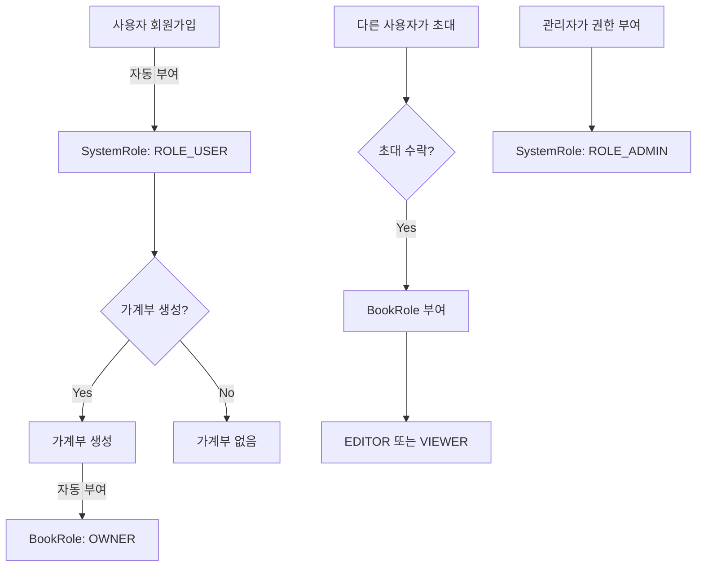

# 가라부 서버 권한 체계 (Authorization System)

## 📋 개요

가라부 서버는 2단계 권한 체계를 통해 사용자 접근을 제어합니다:
- **시스템 권한 (SystemRole)**: 전체 시스템에 대한 권한
- **가계부 권한 (BookRole)**: 개별 가계부에 대한 권한

## 🔐 권한 구조

### 1. 시스템 권한 (SystemRole)

```java
public enum SystemRole {
    ROLE_USER,   // 일반 사용자 (로그인, 서비스 이용 가능)
    ROLE_ADMIN   // 전체 관리자 (모든 유저/가계부 관리)
}
```

- **ROLE_USER**: 회원가입 시 자동 부여되는 기본 권한
- **ROLE_ADMIN**: 시스템 관리자 권한 (수동 부여)

### 2. 가계부 권한 (BookRole)

```java
public enum BookRole {
    OWNER,   // 가계부 소유자 (모든 권한)
    EDITOR,  // 편집자 (읽기, 쓰기 권한)
    VIEWER   // 조회자 (읽기 권한만)
}
```

- **OWNER**: 가계부 생성 시 자동 부여, 멤버 관리 권한 보유
- **EDITOR**: 가계부 내용 읽기/쓰기 가능
- **VIEWER**: 가계부 내용 읽기만 가능

## 🔄 권한 부여 흐름



## 💻 구현 상세

### 1. 회원가입 시 권한 부여

```java
// MemberService.java
@Transactional
public Long join(Member member) {
    validateDuplicateMember(member);
    validateDuplicateEmail(member);
    
    // 기본 권한 설정
    if (member.getSystemRole() == null) {
        member.setSystemRole(SystemRole.ROLE_USER);
    }
    
    memberRepository.save(member);
    return member.getId();
}
```

### 2. 가계부 생성 시 OWNER 권한 자동 부여

```java
// BookService.java
@Transactional
public Book createBook(String title) {
    // ... 가계부 생성 로직 ...
    
    // UserBook 생성 - 생성자에게 OWNER 권한 부여
    UserBook userBook = new UserBook();
    userBook.setMember(owner);
    userBook.setBook(book);
    userBook.setBookRole(BookRole.OWNER);
    userBookJpaRepository.save(userBook);
    
    return book;
}
```

### 3. 권한 검증 예제

```java
// LedgerApiController.java
@PostMapping("/ledgers")
public ResponseEntity<CreateLedgerResponse> createLedger(@Valid @RequestBody CreateLedgerRequest request) {
    // ... 사용자 확인 ...
    
    // 가계부 권한 확인
    UserBook userBook = userBookService.findByBookIdAndMemberId(book.getId(), currentMember.getId())
            .orElseThrow(() -> new ResponseStatusException(HttpStatus.FORBIDDEN, "접근 권한 없음"));
    
    // VIEWER는 기록 작성 불가
    if (userBook.getBookRole() == BookRole.VIEWER) {
        throw new ResponseStatusException(HttpStatus.FORBIDDEN, "조회 권한만 있습니다");
    }
    
    // ... 기록 생성 로직 ...
}
```

## 🌐 API 엔드포인트별 권한

### 공개 엔드포인트 (인증 불필요)
- `POST /api/v2/join` - 회원가입
- `POST /login` - 로그인
- `/swagger-ui/**` - API 문서

### 인증 필요 엔드포인트
- `GET /api/v2/members` - 회원 목록 조회 (ROLE_USER 이상)
- `GET /api/v2/user/me` - 내 정보 조회 (ROLE_USER 이상)
- `POST /api/v2/books` - 가계부 생성 (ROLE_USER 이상)
- `POST /api/v2/ledgers` - 가계부 기록 작성 (ROLE_USER + BookRole.OWNER/EDITOR)
- `GET /api/v2/ledgers` - 가계부 기록 조회 (ROLE_USER + BookRole 보유)

### 관리자 전용 엔드포인트
- `/admin/**` - 관리자 기능 (ROLE_ADMIN)

## 🔧 Security 설정

```java
// SecurityConfig.java
http.authorizeHttpRequests((auth) -> auth
    .requestMatchers("/reissue", "/swagger-ui/**", "/v3/api-docs/**", 
                    "/login", "/", "/api/v2/join", "/join").permitAll()
    .requestMatchers("/admin/**").hasRole("ADMIN")
    .requestMatchers("/api/v2/**").hasAnyRole("USER", "ADMIN")
    .anyRequest().authenticated()
);
```

## 📊 데이터베이스 구조

### Member 테이블
| 필드 | 타입 | 설명 |
|------|------|------|
| member_id | Long | PK |
| username | String | 사용자명 |
| email | String | 이메일 |
| password | String | 암호화된 비밀번호 |
| system_role | String | 시스템 권한 (ROLE_USER/ROLE_ADMIN) |
| provider_id | String | OAuth2 제공자 ID |

### UserBook 테이블
| 필드 | 타입 | 설명 |
|------|------|------|
| id | Long | PK |
| member_id | Long | FK - Member |
| book_id | Long | FK - Book |
| book_role | String | 가계부 권한 (OWNER/EDITOR/VIEWER) |

## 🚀 사용 예제

### 1. 회원가입
```bash
POST /api/v2/join
{
    "email": "user@example.com",
    "username": "홍길동",
    "password": "password123"
}
# 응답: { "id": 1 }
# 자동으로 ROLE_USER 권한 부여
```

### 2. 가계부 생성
```bash
POST /api/v2/books
Authorization: Bearer {JWT_TOKEN}
{
    "title": "가족 가계부"
}
# 응답: { "id": 1, "title": "가족 가계부" }
# 자동으로 BookRole.OWNER 권한 부여
```

### 3. 가계부에 사용자 초대
```bash
POST /api/v2/books/1/invite
Authorization: Bearer {JWT_TOKEN}
{
    "email": "friend@example.com",
    "role": "EDITOR"
}
# OWNER 권한 필요
```

### 4. 가계부 기록 작성
```bash
POST /api/v2/ledgers
Authorization: Bearer {JWT_TOKEN}
{
    "title": "가족 가계부",
    "amount": 50000,
    "description": "장보기",
    "amountType": "EXPENSE"
    // ...
}
# OWNER 또는 EDITOR 권한 필요
```

## ⚠️ 주의사항

1. **신규 회원의 BookRole**
   - 회원가입 시에는 BookRole이 없음 (가계부가 없으므로)
   - 첫 가계부 생성 시 자동으로 OWNER 권한 획득
   - 다른 사용자의 가계부에 초대받을 때 EDITOR/VIEWER 권한 획득

2. **권한 변경**
   - OWNER는 다른 멤버의 BookRole 변경 가능
   - OWNER 권한은 양도 불가 (보안상 제한)
   - SystemRole은 관리자만 변경 가능

3. **권한 검증**
   - 모든 가계부 관련 API는 BookRole 검증 필수
   - 권한 없는 접근 시 403 Forbidden 응답

## 📝 개발 로드맵

- [ ] 권한 위임 기능 (OWNER 권한 양도)
- [ ] 임시 권한 부여 (기간 제한)
- [ ] 세분화된 권한 (예: 특정 카테고리만 수정 가능)
- [ ] 권한 변경 이력 관리

## 🤝 기여하기

권한 시스템 개선에 대한 제안은 이슈를 통해 남겨주세요.

---

최종 업데이트: 2025-01-09 